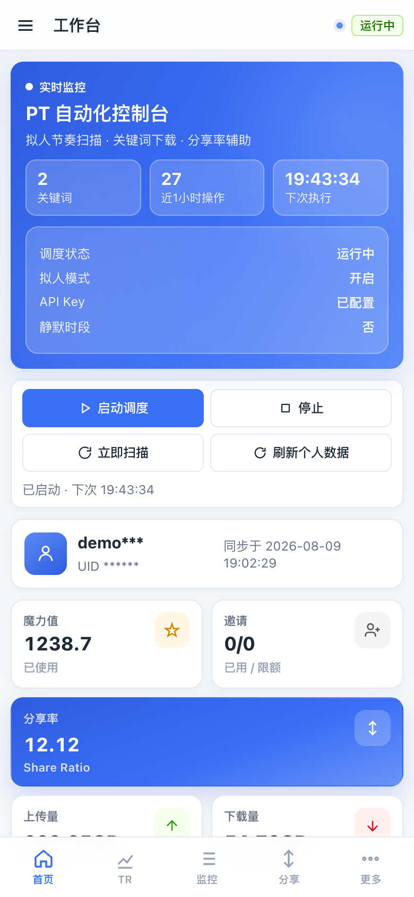
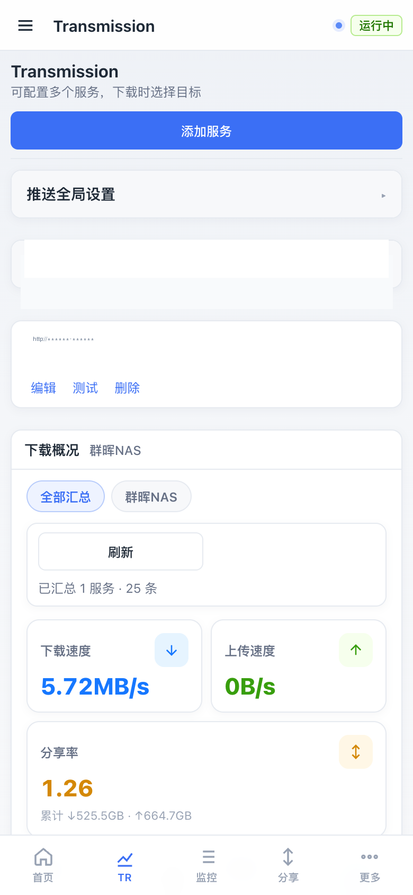
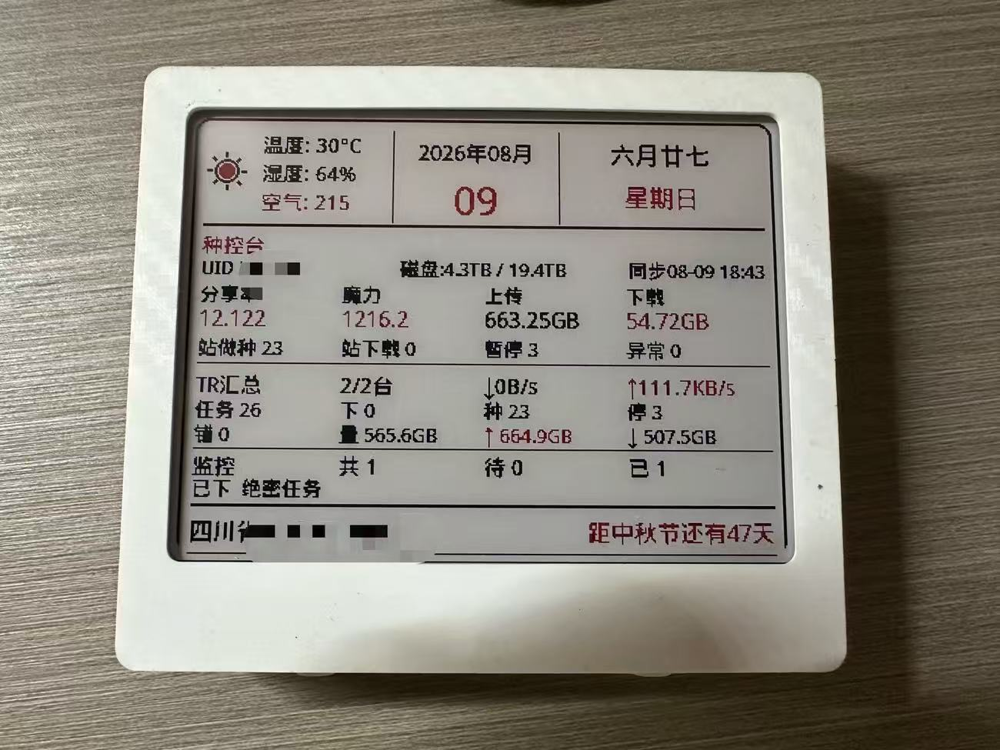
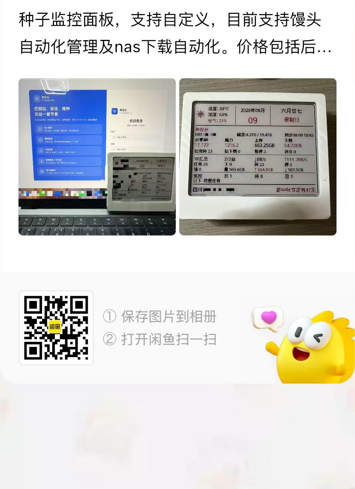

# 种控台 · PT 站自动化平台

> 把刷站、保活、推种，交给一套可自控的节奏。

面向馒头等 PT 站点的**自托管**控制台：拟人调度防封、关键词监控下载、分享率辅助刷流，一键推到多台 Transmission；手机可管，群晖可跑，还能直出三色墨水屏。

[](VERSION)
[](Dockerfile)
[](requirements.txt)
[](docker-compose.synology.yml)
[](static/)

截图中的 UID、账号、API Key、站点地址等均已打码。

---

## 为什么选种控台

| | |
| --- | --- |
| **真·拟人节奏** | 随机间隔、小时配额、静默时段，不是无脑死循环扫站 |
| **监控够聪明** | 爱好关键词精选版本；分享监控按魔力公式挑「大体积 · 少做种 · 存活久」 |
| **TR 全自动** | 多机推送 + 分享率/做种天数/空闲/异常等清理规则，磁盘自己腾 |
| **群晖友好** | 一份 `docker-compose.synology.yml`，导入镜像即可跑 |
| **随身可管** | 手机底栏导航，调度 / TR / 监控随时点 |
| **桌面墨水屏** | 400×300 三色面板，天气农历 + 站点与 TR 汇总一眼看完 |

---

## 界面一览

### 桌面端

<p align="center">
  
  
</p>
<p align="center"><sub>登录页 · 首页概览</sub></p>

<p align="center">
  
  
</p>
<p align="center"><sub>Transmission 多机 · 站点配置</sub></p>

### 移动端

手机也能看调度状态、刷 TR、管监控——响应式布局 + 底栏导航，沙发上也能点两下。

<p align="center">
  
  
  
</p>
<p align="center"><sub>登录 · 工作台 · Transmission</sub></p>

<p align="center">
  
</p>
<p align="center"><sub>心愿单收集页（可对外分享）</sub></p>

### 三色墨水屏

设备拉 `GET /generate-image`，天气、农历、种控台数据与 TR 汇总直接刷到 400×300 面板。

<p align="center">
  
  
</p>
<p align="center"><sub>面板预览 · 实机效果</sub></p>

---

## 群晖 / NAS 部署

专为群晖 Container Manager（及同类 NAS Docker）准备了 compose 与 amd64 镜像包。

### 三步上手

```bash
# 1）本机或 CI 打包
./pack.sh
# 得到 dist/mt-pt-<version>-amd64.tar.gz

# 2）上传到群晖并导入
docker load -i dist/mt-pt-1.0.5-amd64.tar.gz

# 3）在项目目录启动
mkdir -p data downloads
docker compose -f docker-compose.synology.yml up -d
```

浏览器打开：`http://<群晖IP>:8080`，首次登录后立刻改系统密码。

### 群晖注意点

- 端口映射保持 **`8080 → 8080`**（换镜像后 Container Manager 有时会丢映射）
- `data/`、`downloads/` 挂载到共享文件夹，升级镜像不丢配置
- 访问宿主机 Transmission 时，RPC 可填 `http://host.docker.internal:9091`（compose 已加 `host-gateway`）
- 健康检查已配置，异常退出会按 `restart: unless-stopped` 拉起

更完整的 compose 见 [`docker-compose.synology.yml`](docker-compose.synology.yml)。

---

## Transmission 自动化

把「下完就忘、盘满了才急」变成规则驱动：

1. **多机管理**  
   同时挂多台 Transmission（群晖 / 软路由 / 公网 VPS），爱好监控、分享监控、手动下载可指定不同默认机。

2. **自动推送**  
   匹配到的种子可直推 RPC，无需再拷 `.torrent`。

3. **任务自动清理**（可开关）  
   按间隔巡检，支持组合规则：
   - 分享率达标  
   - 做种满 N 天  
   - 空闲满 N 天  
   - 异常任务  
   - 单机做种数上限  

4. **一眼概况**  
   汇总下载/上传速度、分享率、剩余与总量空间，墨水屏同步展示。

适合「白天挂着刷、晚上回来只看结果」的玩法。

---

## 移动端支持

- 自动识别窄屏，切换移动布局与底栏：首页 / TR / 监控 / 分享 / 更多  
- 核心操作（启停调度、刷新个人数据、TR 概况）不依赖鼠标悬停  
- 心愿单独立页，发给朋友填片名即可进监控池  

局域网或反代到 HTTPS 后，手机浏览器当「轻量 App」用即可。

---

## 功能矩阵

| 模块 | 你能得到什么 |
| --- | --- |
| 拟人防封 | 随机间隔、小时配额、静默时段、翻页/动作延迟 |
| 爱好监控 | 关键词 + 排除词，按清晰度/体积保留最优版本 |
| 分享监控 | 魔力公式优选，可定时刷、可自动推 TR |
| 签到保活 | 每日时段内自动浏览，维持活跃 |
| Transmission | 多 RPC、推送策略、清理规则、速度与空间概况 |
| 日志中心 | 访问 / PT / 下载 / 墨水屏，出了问题能回溯 |
| 墨水屏 | 400×300 三色 BMP，省市区天气 + 站点/TR/监控 |
| 心愿单 | 对外收集页，提交后可采纳进监控 |

---

## 快速开始（通用 Docker）

```bash
./pack.sh
docker load -i dist/mt-pt-1.0.5-amd64.tar.gz
mkdir -p data downloads
docker compose -f docker-compose.synology.yml up -d
```

### 本地开发

```bash
pip install -r requirements.txt
DATA_DIR=./data DOWNLOAD_DIR=./downloads \
  uvicorn app.main:app --host 0.0.0.0 --port 8080
```

---

## 墨水屏配置

1. **系统设置 → 墨水屏面板** 填写省市区（默认成都）  
2. 设备图片地址：

   ```text
   http://<主机IP>:8080/generate-image
   ```

3. 响应头 `wt`：`1005` = 5 分钟，`0` = 1 小时，`1` = 2 小时  
4. 设备渲染建议选 **不处理**（避免二次抖动）

---

## 目录结构

```text
app/                         后端（调度 / 站点 / TR / 墨水屏）
static/                      Web（桌面 + 移动）
docker-compose.synology.yml  群晖推荐编排
data/                        运行配置（勿提交）
downloads/                   种子目录（勿提交）
dist/                        mt-pt-<version>-amd64.tar.gz
docs/images/                 文档截图（已打码）
```

---

## 版本

见 [VERSION](VERSION)，或请求 `GET /api/version`。

---

## 支持一下

如果本项目帮到你，欢迎支持硬件继续折腾：

<p align="center">
  
</p>

---

## 免责声明

仅供学习与个人站点管理。请遵守所在 PT 站规则与当地法律法规，合理使用自动化能力，风险自负。
