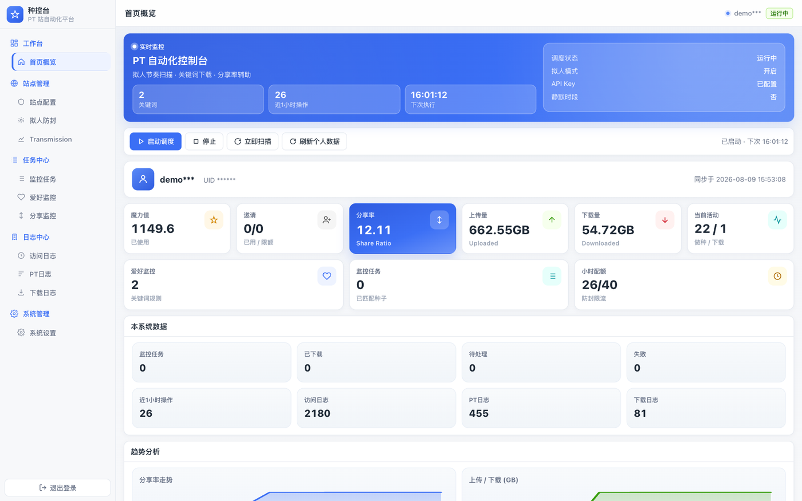
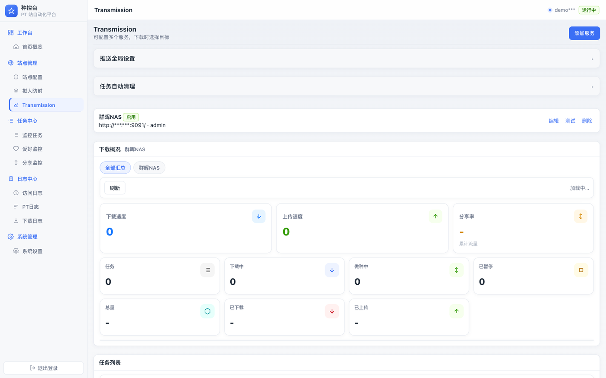
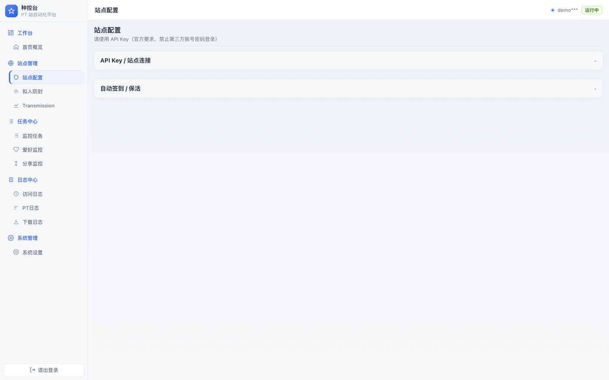
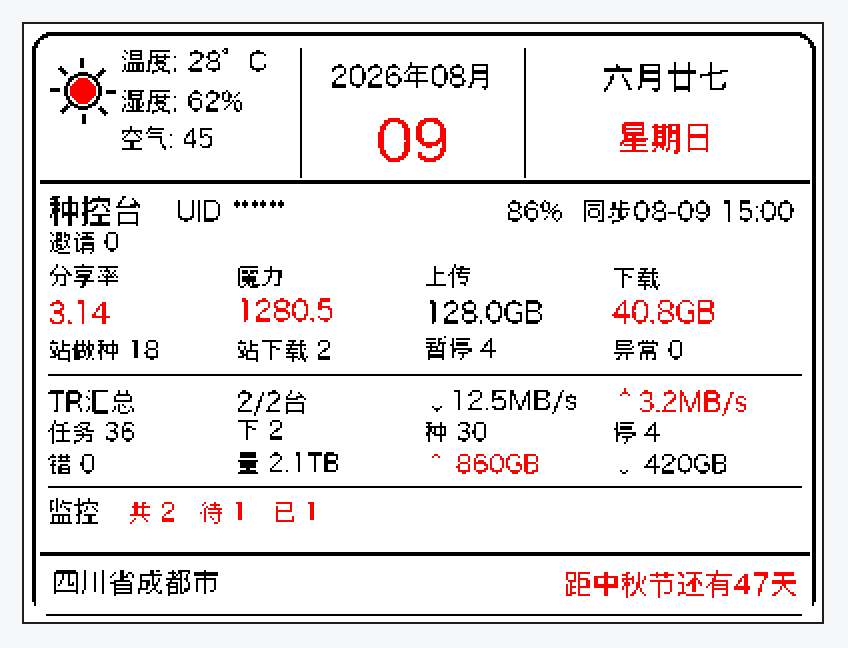

# 种控台 · PT 站自动化平台

[](VERSION)
[](Dockerfile)
[](requirements.txt)

面向 PT 站点的自托管自动化控制台：拟人调度、关键词监控、分享率辅助、多机 Transmission 推送，并支持 COOIOT 风格三色墨水屏面板。

> 截图中的 UID、账号、API Key、站点地址等敏感信息均已打码，仅作功能展示。

---

## 界面预览

### 登录页


### 首页概览



### Transmission 多机管理



### 站点配置



### 三色墨水屏面板（400×300）

设备通过 `GET /generate-image` 拉取 BMP 图片，展示天气、农历、站点数据、TR 汇总与监控任务。



---

## 功能概览

| 模块 | 说明 |
| --- | --- |
| 拟人防封 | 随机间隔、小时配额、静默时段、页面/动作延迟 |
| 爱好监控 | 关键词匹配，按清晰度/体积精选最多 N 个版本 |
| 分享监控 | 按魔力公式推荐：大体积 · 少做种 · 存活久 |
| 签到保活 | 每日自动浏览，维持账号活跃 |
| Transmission | 多服务器配置、任务概览、暂停/删除、自动清理规则 |
| 日志中心 | 访问 / PT / 下载日志分页查看 |
| 墨水屏 | 400×300 三色 BMP，天气 + 农历 + 站点/TR/监控数据 |
| 心愿单 | 独立收集页，可对外分享链接 |

心愿单：


---

## 快速开始

### 环境要求

- Docker（推荐）或 Python 3.12+
- 可访问 PT 站点 API
- （可选）Transmission RPC
- （可选）COOIOT / 同类墨水屏设备

### Docker 部署

```bash
# 1. 打包（本地 amd64 镜像 + tar.gz）
./pack.sh

# 2. 导入镜像（群晖 / NAS 上）
docker load -i dist/mt-pt-1.0.5-amd64.tar.gz

# 3. 启动
mkdir -p data downloads
docker compose -f docker-compose.synology.yml up -d
```

浏览器访问 `http://<主机IP>:8080`，首次登录后修改系统密码。

> 群晖 Container Manager 换镜像后请检查端口映射：`8080 → 8080`。

### 本地开发

```bash
pip install -r requirements.txt
DATA_DIR=./data DOWNLOAD_DIR=./downloads uvicorn app.main:app --host 0.0.0.0 --port 8080
```

---

## 墨水屏配置

1. 在 **系统设置** 中填写 `ink_city`（默认成都），用于天气与底栏地点。
2. 设备图片 URL 指向：

   ```
   http://<主机IP>:8080/generate-image
   ```

3. 响应头 `wt: 0` 表示由设备按小时刷新，无需服务端定时任务。
4. 输出格式：400×300 BMP，黑 / 白 / 红三色。
硬件效果：


---

## 目录结构

```
app/          FastAPI 后端（调度、站点、TR、墨水屏）
static/       Web 管理界面
data/         配置与运行数据（挂载卷）
downloads/    种子下载目录（挂载卷）
dist/         打包产物 mt-pt-<version>-amd64.tar.gz
docs/images/  文档截图（已打码）
```

---

## 版本

当前版本见 [VERSION](VERSION)，接口 `GET /api/version` 可查询。

---

## 免责声明

本项目仅供学习与个人站点管理使用。请遵守所在 PT 站点规则与当地法律法规，合理使用自动化功能，风险自负。
